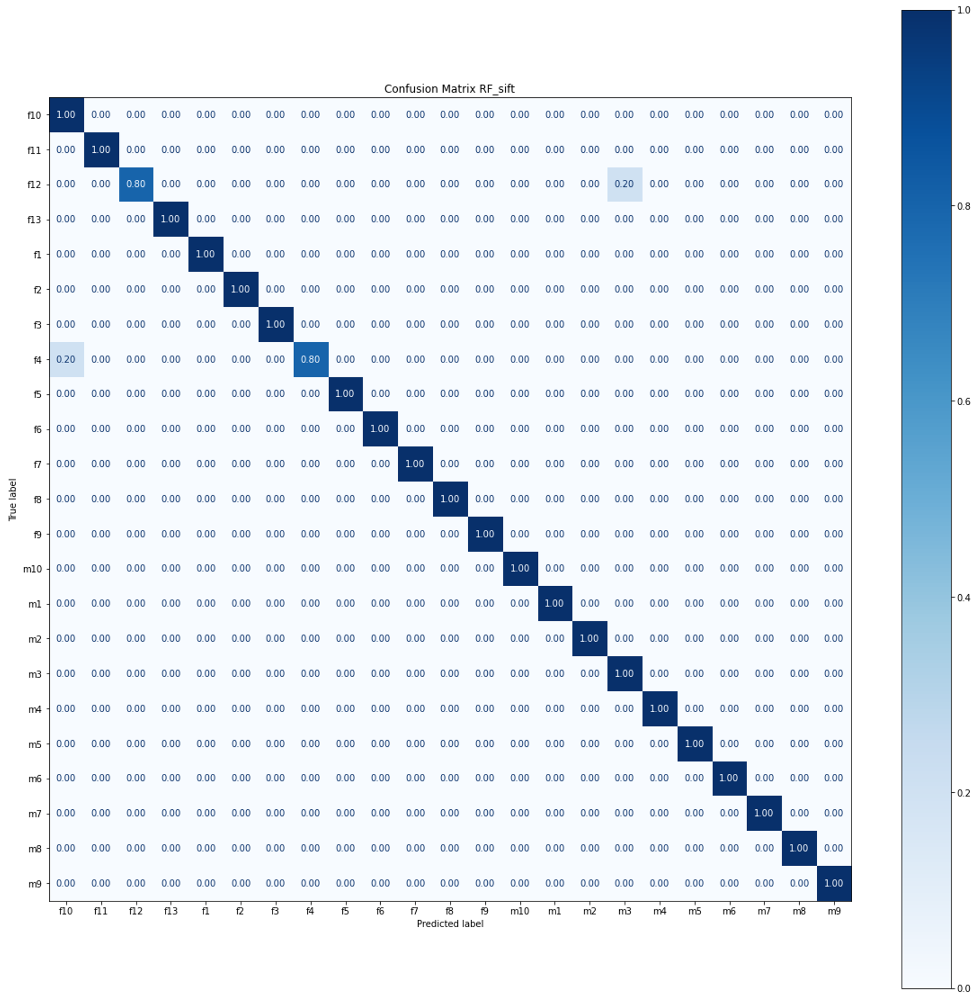
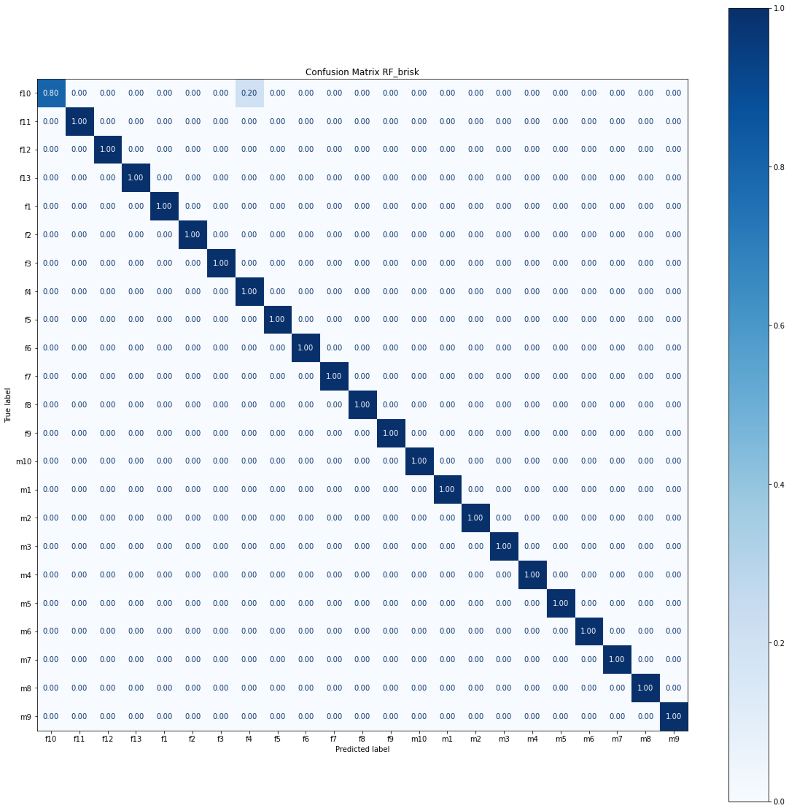
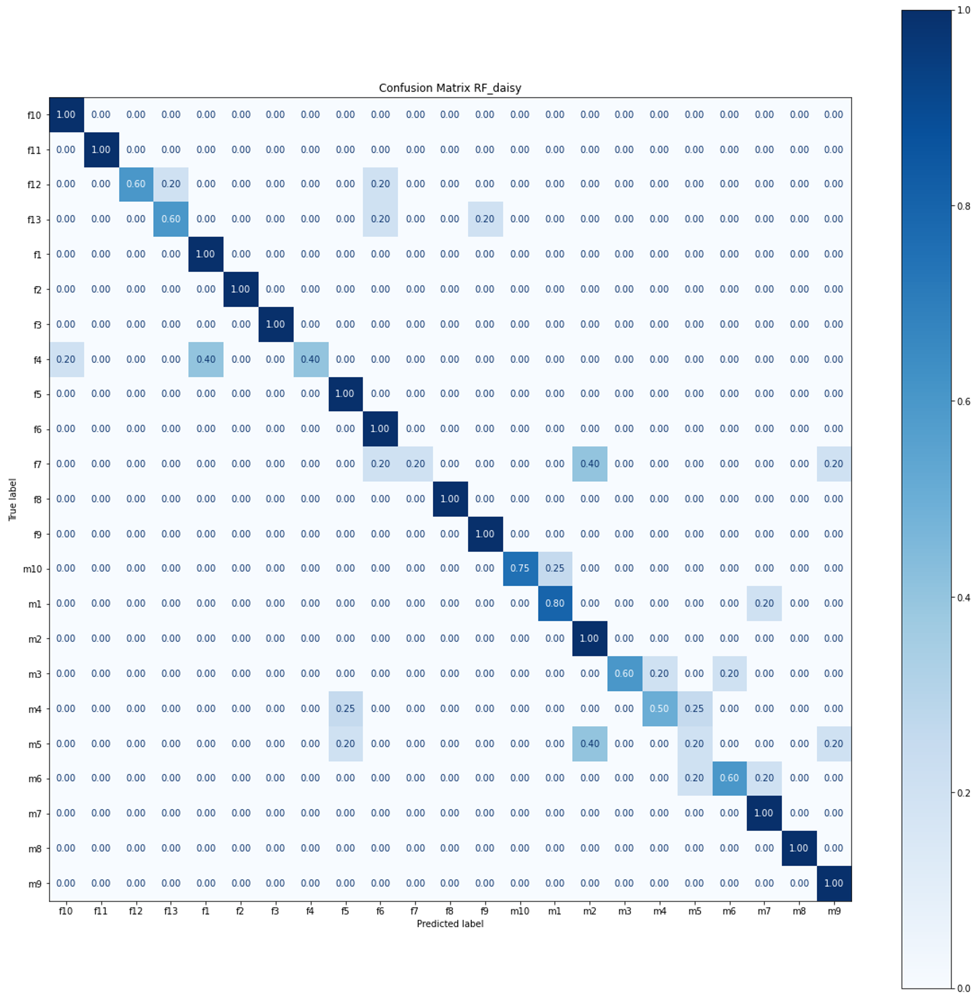

Results
==============================

## SIFT

Para SIFT y RF se tienen los siguientes resultados:

| Accuracy | Macro Precision | Macro Recall | Macro F1 |
|:--------:|:---------------:|:------------:|:--------:|
|   0.98   |       0.99      |     0.98     |   0.98   |

Confusion Matrix:

## BRISK

Para BRISK y RF se tienen los siguientes resultados:

| Accuracy | Macro Precision | Macro Recall | Macro F1 |
|:--------:|:---------------:|:------------:|:--------:|
|   0.99   |       0.99      |     0.99     |   0.99   |

Confusion Matrix:

## ORB

Para ORB y RF se tienen los siguientes resultados

| Accuracy | Macro Precision | Macro Recall | Macro F1 |
|:--------:|:---------------:|:------------:|:--------:|
|   0.99   |       0.99      |     0.99     |   0.99   |

## DAISY

Para Daisy y RF se tienen los siguientes resultados

| Accuracy | Macro Precision | Macro Recall | Macro F1 |
|:--------:|:---------------:|:------------:|:--------:|
|   0.79   |       0.82      |     0.79     |   0.77   |

